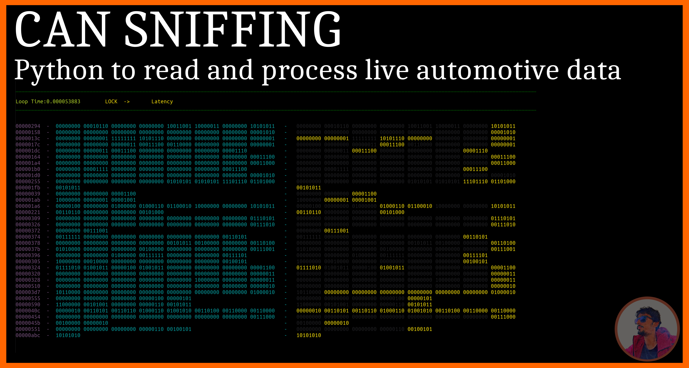

# Welcome  :smiley:

**I am an Embedded Designer who likes to work on fun projects or challenging problems.\
Feel free to get in touch regrading any project or collab work realted to electronics.**

&nbsp;
&nbsp;

<t></t>
## My Work

**[Android Watchdog](https://github.com/sultania1ankit/):** &ensp;A background android service to monitor the health and status of your server, sensors, nodes and other servives.It uses the [Cold Codec Protocol](https://github.com/sultania1ankit/) for the communication.
  
**[Cold Codec Protocol](https://github.com/sultania1ankit/):** This was developed to sync the communication of various stages of an embedded ecosystem.
> **MCU <--> Debug <--> Server <--> Mobile <--> PC**

This can be used over UART, TCP, UDP or any other protocol where the channel has sufficient bitrate. 
  

**[Hydro Scout](https://github.com/sultania1ankit/):** This system which allows for smooth water mangement in urban locations.
  

**[CAN Sniffers](https://github.com/sultania1ankit/):** This can be used to process and filter real time data of a automotive CAN bus.Data can also be saved for later analysis.It uses a ESP32 and a CAN transceiver as a sniffer, coupled with few python scripts.
  

**[Projects](https://github.com/sultania1ankit/projects):** This contains some of my work which i think can be useful for others. However it has not been modified, so you might have to put some effort. :hand_over_mouth:
  

## Statistics
<t></t>
&nbsp;&nbsp;&nbsp;&nbsp;&nbsp;&nbsp;&nbsp;

  
## Thank you for visiting ! :smiley:

